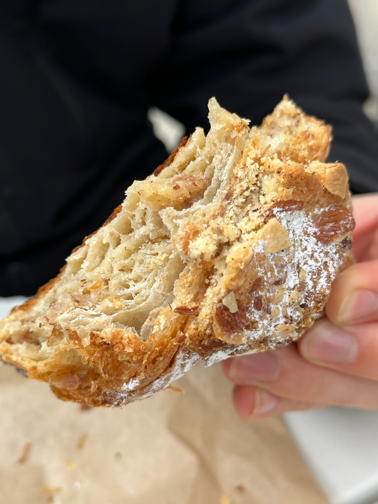

import Gray from '@/components/gray.astro';
import Image from '@/components/Image.astro'
import cortado from './IMG_3194.png'

I spent the beginning of my spring break in Chicago and had the opportunity to try out a few specialty coffee shops on my trip. Here's the good, the bad, and the really bad.

## Sawada Coffee (West Loop)
The first place we checked out was [Sawada Coffee](https://www.instagram.com/sawadacoffee/). The aesthetic in here was on point. I thought the branding was on point and the shared space with the Texas-style BBQ place was really sick.

But that's really where all the good things about this place end...

{/* <Image image={cortado} float='left'> */}
# inside?
Here's my oat cortado with their **Project X Espresso**. Latte art was impressive, but the milk texture was too heavy. Espresso was wildly dark, like charred. Honestly some of the worst espresso I've had from such a nice setup.
{/* </Image> */}

|  | 
| :-: | 
| def |

|  | Lorem ipsum dolor sit amet, consectetur adipiscing elit. Nullam ut nulla in magna hendrerit ullamcorper. Vivamus in nunc nibh. Ut semper vitae mauris in dignissim. Vivamus porta a justo et posuere. Etiam varius eget turpis et eleifend. Ut tellus turpis, maximus a neque id, lacinia dictum elit. Pellentesque pellentesque purus quis diam molestie vestibulum. Cras euismod non lectus in rhoncus. Vestibulum ante ipsum primis in faucibus orci luctus et ultrices posuere cubilia curae; Donec ut nisl eu ante dignissim ullamcorper non vel magna. In volutpat nibh id tellus posuere, sit amet porta risus tincidunt. Praesent tincidunt mauris ut ligula lacinia varius. Sed tempor ipsum at neque suscipit, porttitor viverra ipsum ultricies. |
| --- | --- |

## Allez Cafe

## Metric